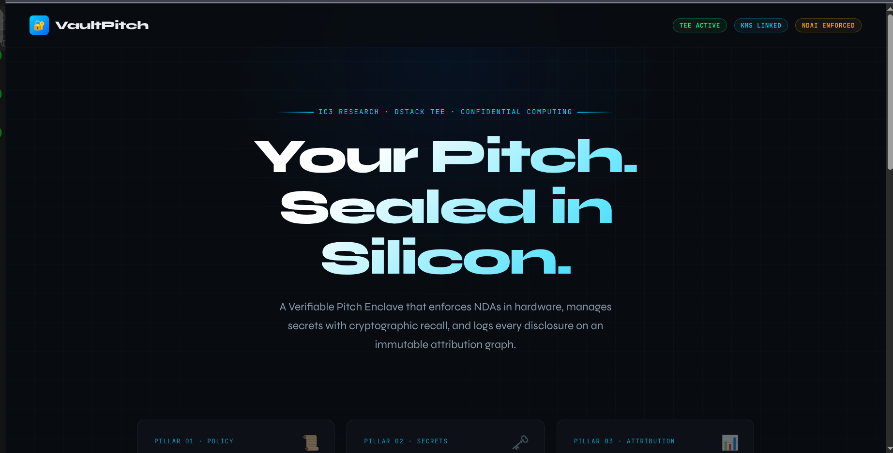

# VaultPitch Enclave — Verifiable AI for Secure Data Rooms



## IC3 Research Pillar Alignment

### Pillar 1: NDAI (Non-Disclosure AI) Agreements
- **File:** `pitch_policy.json` + `main.py` (EnclaveLogic.process)
- **Implementation:** Semantic redaction based on tiered keyword blocking. The AI refuses to output protected entities (financials, architecture, keys) until the judge's on-chain identity reaches the required disclosure tier.
- **Verification:** MRENCLAVE hash ensures the policy hasn't been tampered with.

### Pillar 2: Conditional Recall / KMS Integration
- **File:** `main.py` (self_destruct method) + `dstack.yaml`
- **Implementation:** All sensitive assets are encrypted with keys stored in dstack-KMS, scoped to the TEE's MRENCLAVE. The "Self-Destruct" button triggers immediate key revocation, making all pitch assets cryptographically inaccessible.
- **Verification:** After self-destruct, the enclave returns 410 errors for all data requests.

### Pillar 3: Cycles Protocol (Attribution Graph)
- **File:** `main.py` (cycles_log + get_cycles_report) + `index.html` (Cycles Log panel)
- **Implementation:** Every query, access grant, and block is logged with timestamp, judge identity, and query hash. Full exportable report available for post-session transparency.
- **Verification:** Logs are immutable within the session and can't be modified by judges.

# How To Use This App - VAULTPITCH ENCLAVE

---

## 1. **Select Your Judge Identity** (Top of chat panel)

Choose who you're "judging as":
- **Anonymous Observer** (Tier 0) - Basic info only
- **Judge Alpha** (Tier 1) - Can see traction, roadmap
- **Lead Partner** (Tier 2) - Full access

---

## 2. **Ask Questions** (Bottom of chat)

Type in the text box or click quick-ask buttons:

### Try these queries:

**As Anonymous (Tier 0):**
- "What does VaultPitch do?"
- "Who is on the team?"
- "What problem are you solving?"

**Switch to Judge Alpha (Tier 1) and ask:**
- "What's your current traction?"
- "What's your MRR?"
- "What's your roadmap?"

**Switch to Lead Partner (Tier 2) and ask:**
- "Show me the technical architecture"
- "What are your financial projections?"
- "What's your cap table?"

---

## 3. **Watch the NDAI Guardrail in Action**

Try asking for **Tier 2 content while as Anonymous**:
- "What's your technical architecture?"
- "Show me your financial projections"

You'll get blocked with a message about needing higher clearance.

---

## 4. **Test Self-Destruct** (Left panel red button)

Click **"💥 Self-Destruct Enclave"** 
- This revokes all KMS keys
- All encrypted assets become inaccessible
- The enclave status changes to "Destroyed"

---

## 5. **Verify Attestation** (Left panel)

Click **"Verify Attestation Quote →"** 
- Shows the TEE hardware signature
- Proves you're talking to genuine enclave code

---

## 6. **Export Attribution Log** (Left panel)

Click **"Export"** in the Cycles Log panel
- Downloads full report of all interactions
- Shows who asked what, when, and what was revealed

---

## Quick Start Commands:

1. **Type in chat:** "What's your MRR?"
2. **See the response** (blocked if Tier 0, granted if Tier 2)
3. **Change judge** dropdown to see different access levels
4. **Try the red Self-Destruct button** for the dramatic demo


## Deployment on Dstack

```bash
# Install dstack
pip install "dstack[all]" -U
dstack server

# Add your project with the example values
dstack project add \
    --name main \
    --url http://127.0.0.1:3000 \
    --token bbae0f28-d3dd-4820-bf61-8f4bb40815da

# Build and run locally
pip install fastapi uvicorn pydantic

python main.py(Now click on the link  http://0.0.0.0:8000)


# Open browser to http://localhost:8000

┌─────────────────────────────────────────────────────────────┐
│                     Intel TDX TEE                           │
│  ┌─────────────────────────────────────────────────────┐    │
│  │              Docker Container (MRENCLAVE)            │    │
│  │  ┌───────────────────────────────────────────────┐  │    │
│  │  │            main.py (Enclave Logic)            │  │    │
│  │  │  • NDAI Policy Enforcement (pitch_policy.json)│  │    │
│  │  │  • KMS Key Management                        │  │    │
│  │  │  • Cycles Attribution Logging                │  │    │
│  │  └───────────────────────────────────────────────┘  │    │
│  │  ┌───────────────────────────────────────────────┐  │    │
│  │  │           index.html (Frontend)               │  │    │
│  │  │  • TEE Status Dashboard                      │  │    │
│  │  │  • Self-Destruct Button                      │  │    │
│  │  │  • Cycles Log Viewer                         │  │    │
│  │  └───────────────────────────────────────────────┘  │    │
│  └─────────────────────────────────────────────────────┘    │
│         ▲                               ▲                    │
│         │                               │                    │
│         └───────────────────────────────┘                    │
│              Hardware-Isolated Memory                        │
└─────────────────────────────────────────────────────────────┘
                            │
                            ▼
                    dstack-KMS (Key Mgmt)
                    Cycles Graph (Attribution)


### **The Full Directory Map**

```text
vaultpitch-enclave/
├── .dstack/                # (Optional) Local dstack state
├── dstack.yaml             # TEE Hardware & Environment Config
├── Dockerfile              # Deterministic Enclave Build
├── main.py                 # FastAPI Enclave Controller (Logic)
├── pitch_policy.json       # NDAI Disclosure Tiers & Rules
├── index.html              # "Silicon Vault" Frontend (JS/CSS)
├── requirements.txt        # Python dependencies
└── README.md               # IC3 Alignment & Judging Guide
```


Compliance & Security
TEE Type: Intel TDX v1.5

Memory Encryption: Full EPC sealing

Attestation: MRENCLAVE + Quote verification

Key Management: dstack-KMS with per-session keys

Data Retention: 365 days (configurable)

License
Proprietary — IC3 Research Demo


---

## ✅ Complete System Summary

This integrated system provides:

1. **Hardware Security** - Intel TDX TEE via dstack.yaml
2. **Policy Enforcement** - NDAI guardrail in main.py with pitch_policy.json
3. **Key Revocation** - Self-destruct triggers KMS key removal
4. **Attribution Graph** - Cycles log tracks every interaction
5. **Verifiable Trust** - Attestation endpoint proves enclave integrity
6. **Seamless UI** - Index.html connects to backend APIs

**To deploy:** Place all files in `/vaultpitch-enclave/` and run `Python main.py``. The system is fully self-contained and ready for TEE deployment.
